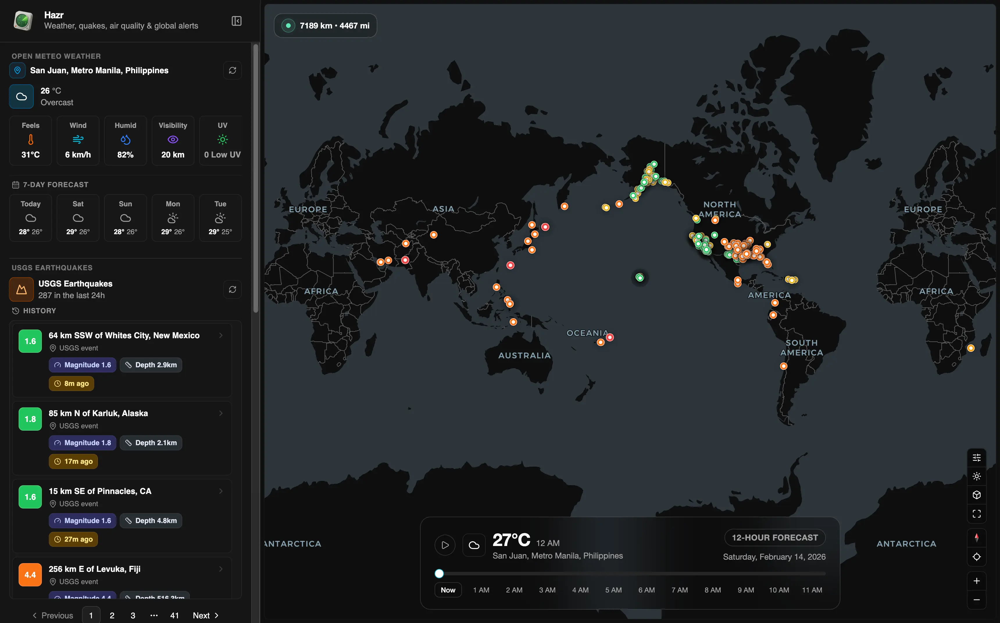

# Hazr - Live Quakes & Weather

🗺️ Real-time geospatial hazard dashboard using Vite, Mapcn (MapLibre), & Tailwind, unifying USGS earthquakes, & Open-Meteo weather into map.

## ☁️ Deploy your own

[](https://vercel.com/new/clone?repository-url=https://github.com/KurutoDenzeru/Hazr)  [](https://app.netlify.com/start/deploy?repository=https://github.com/KurutoDenzeru/Hazr)

## ✨ Features

- **Live Quakes & Weather:** Aggregates USGS real-time earthquake feeds and Open‑Meteo forecasts to show current seismic and weather conditions on a single map.
- **Interactive Map UI:** Map-based interface (MapLibre via Mapcn) with clustering, zoom, and informative popovers for earthquake and weather details.
- **Real-time Updates & Efficiency:** Polling and lightweight caching for near‑real‑time data with controls to refresh and limit bandwidth.
- **Accessible & Responsive:** Desktop docks, resizable panels, and a mobile bottom nav; keyboard accessible controls and ARIA labels across components.
- **Filterable & Customizable Views:** Filter by magnitude, time range, and weather variables; configurable docks and widgets for custom workflows.
- **Modular & Extensible:** Clean component boundaries and hooks making it easy to add new data sources, widgets, or visualizations.

## 🧱 Tech Stack

- [Vite](https://vitejs.dev/): Fast dev server and build tool.
- [React](https://reactjs.org/): Component-driven UI library.
- [TypeScript](https://www.typescriptlang.org/): Static typing and developer tooling.
- [Tailwind](https://tailwindcss.com/): Utility-first styling system.
- [MapLibre / Mapcn](https://maplibre.org/): Map rendering and tile handling (Mapcn integration for MapLibre).
- [shadcn/ui](https://ui.shadcn.com/): UI primitives, composition patterns, and design tokens.

## ⚡ Getting Started

Clone the repo, install deps, and boot the dev server:

```bash
git clone https://github.com/KurutoDenzeru/Hazr.git
cd Hazr
bun install
bun run dev
```

Open [http://localhost:3000](http://localhost:3000) to view the app.

## 📦 Build for Production

```bash
bun run build
bun start
```

## 🗂️ Configuration

The app is implemented under `src/`. Key areas to customize and extend are:

```text
src/
	App.tsx                 # Root app component
	main.tsx                # App bootstrap and providers
	index.css               # Tailwind & base styles
	components/             # Re-usable UI components
		hazr-earthquake-item.tsx
		hazr-menu-panel.tsx
		hazr-sidebar.tsx
		hazr-weather-icon.tsx
		mobile-bottom-nav.tsx
		openstreet-map.tsx
		seismic-activity.tsx
		layout/                # Layout components (header, footer, docks)
		map/                   # Map-related components and popovers
			earthquake-popover.tsx
			hourly-forecast-dock.tsx
			weather-dock.tsx
	ui/                     # Shadcn/Radix wrappers and primitives (button, popover, input, etc)
	hooks/                  # Data hooks (use-earthquakes, use-weather)
	lib/                    # Helpers (ip-location, utils)
	types/                  # TypeScript types and API shapes
public/
	OpenGraph.webp          # Social preview image
	robots.txt              # Crawler rules
```

Quick dev commands:

```bash
npm install
npm run dev
## 🤝🏻 Contributing

Contributions are always welcome, whether you’re fixing bugs, improving docs, or shipping new features that make the project better for everyone.

Check out [Contributing.md](Contributing) to learn how to get started and follow the recommended workflow.

<!-- Please adhere to this project's `Code of Conduct`. -->

## ⚖️ License

This project is released under the MIT License, giving you the freedom to use, modify, and distribute the code with minimal restrictions.

For the full legal text, see the [MIT](LICENSE) file.